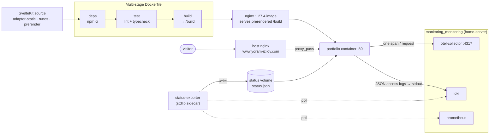

# portfolio

> The personal site of **Yoram Izilov**, DevOps engineer - a static SvelteKit app whose hero is an interactive CI/CD pipeline and whose status badge is fed live by the same self-hosted monitoring stack it documents.

[](https://www.yoram-izilov.com)


A SvelteKit site prerendered to fully static HTML and served by nginx in the `portfolio` container. The **memorable moment** is the home page: an interactive SVG CI/CD pipeline (commit → build → test → deploy → live endpoint) over a cursor-tracking grid, with the three featured projects as graph nodes that open detail panels, and a **live status badge** (`OPERATIONAL` / `degraded` / `down`) plus a visitor count driven by a real `/status.json`.

That status JSON isn't faked - a sidecar polls the production Prometheus and Loki and writes it on an interval, so the site reports its own real uptime and 7-day unique visitors. Observability before it breaks, demonstrated on the site itself.

> The authoritative deep-dive - stack conventions, the Claude Code build system, and hard constraints - lives in [`CLAUDE.md`](CLAUDE.md). This README is the operator's overview.

## Architecture



The `portfolio` container joins **two** external Docker networks (created by other repos): `nginx_nginx_network` for public routing and `monitoring_monitoring` for observability. See [`home-server`](https://github.com/Yoram-Izilov/home-server) for the network contracts.

## Tech stack

- **SvelteKit 2 / Svelte 5** in **runes mode**, prerendered to static via **`@sveltejs/adapter-static`** - no server runtime.
- **TypeScript** (strict), **Vite 8**, **Node 22**.
- **Custom CSS** (a dark "blueprint" theme, `src/app.css`) - no Tailwind; **GSAP** for bespoke motion; Space Grotesk + JetBrains Mono via `@fontsource-variable`.
- **nginx 1.27.4** runtime with the OpenTelemetry dynamic module; a dependency-free Python **status sidecar**.

## Site structure

| Route                    | Page                                                                                                     |
| ------------------------ | -------------------------------------------------------------------------------------------------------- |
| `/`                      | Home - the interactive pipeline hero, the project graph, the live status badge.                          |
| `/work/discord-bot`      | Case study: [`discord-py`](https://github.com/Yoram-Izilov/discord-py), a hobby bot run like production. |
| `/work/home-server`      | Case study: [`home-server`](https://github.com/Yoram-Izilov/home-server), the box that runs this site.   |
| `/work/building-with-ai` | Case study: how this site was built with Claude Code on rails.                                           |

Featured projects live in `src/lib/data/projects.ts`; case-study metadata in `src/lib/data/caseStudies.ts`.

## Repo layout

```
portfolio/
├── src/
│   ├── routes/
│   │   ├── +layout.svelte         # <head> meta, OpenGraph, JSON-LD, Footer
│   │   ├── +layout.ts             # prerender = true
│   │   ├── +page.svelte           # home: pipeline hero + project graph + status
│   │   └── work/{discord-bot,home-server,building-with-ai}/+page.svelte
│   ├── lib/
│   │   ├── components/            # PipelineGraph, InteractiveGrid, ProjectPanel, *Diagram, Footer
│   │   ├── data/                  # projects.ts, caseStudies.ts
│   │   └── actions/, assets/
│   ├── app.css                    # blueprint dark theme (no Tailwind)
│   └── app.html
├── static/                        # og.png, robots.txt, sitemap.xml
├── nginx.conf                     # JSON logs → Loki, OTel spans, caching, /status.json
├── status-exporter/               # stdlib Python sidecar → status.json
├── deploy/nginx-reverse-proxy.conf
├── Dockerfile                     # deps → test → build → nginx 1.27.4
├── docker-compose.yml             # portfolio + status-exporter, two external networks
├── Jenkinsfile
├── svelte.config.js               # adapter-static + runes
├── PORTFOLIO_PROMPT.md            # master build prompt (see CLAUDE.md)
└── CLAUDE.md
```

## Quick start

```bash
npm install
npm run dev        # http://localhost:5173
npm run build      # prerender → build/
npm run preview    # serve the built site locally
npm run lint       # prettier --check . && eslint .
npm run check      # svelte-check (typecheck)
npm run format     # prettier --write .
```

## Docker & deployment

```bash
docker compose up -d --build
```

This builds two services - `portfolio` (the nginx site) and `status-exporter` - and attaches them to the external networks `nginx_nginx_network` and `monitoring_monitoring`, so **both must already exist** (they're created by the host nginx and the `home-server` monitoring stack respectively). The container only `expose`s port 80 on those networks; it is not published to the host.

**Reverse proxy.** The host/edge nginx routes the public domain to the container by name (`proxy_pass http://portfolio:80/`). A sample config is in [`deploy/nginx-reverse-proxy.conf`](deploy/nginx-reverse-proxy.conf): `www.yoram-izilov.com` → the container, and apex `yoram-izilov.com` → 301 → `www`.

**CI/CD.** [`Jenkinsfile`](Jenkinsfile) runs: **Checkout** → **Test** (`docker build --target test` runs lint + typecheck in the image) → **Build image** → **Smoke test** (`curl /` and assert the hero renders "Yoram Izilov") → **Push** (only if `REGISTRY` is set; off by default) → **Deploy** (`docker compose up -d --remove-orphans`, on `main` only). Dangling images are pruned after every run.

## Observability

The site is monitored end-to-end from the `home-server` stack - it has no scrape target of its own:

- **Logs / visitors** - `nginx.conf` writes a structured `json_analytics` access line per request to stdout, which Promtail ships to Loki (`{container="portfolio"}`). Every line carries the request's `trace_id`.
- **Tracing** - the nginx OpenTelemetry module emits one span per request (service `portfolio`) to `otel-collector:4317`; Tempo builds span-metrics and a service map automatically.
- **Uptime / TLS** - a Prometheus black-box job probes `https://www.yoram-izilov.com`.
- **Profiling** - nginx has no Pyroscope SDK, so `home-server`'s `alloy` profiles the process via eBPF.
- **Live status** - `status-exporter/exporter.py` (stdlib only) polls Prometheus (`probe_success`, 7-day uptime) and Loki (7-day unique visitors) every `POLL_SECONDS` (default 300) and atomically writes four curated fields - `status`, `uptime_7d`, `unique_visitors_7d`, `generated_at` - to the shared `status` volume. nginx serves it at `/status.json` (falling back to `204` before the first write). It is deliberately **not** a metrics proxy: no IPs, no hostnames, no query passthrough ever leave the sidecar.

## How this site was built

This repo ships with the build system that produced it - a team of Claude Code subagents that review each other and two blocking/non-blocking hooks (`.claude/`), driven by [`PORTFOLIO_PROMPT.md`](PORTFOLIO_PROMPT.md). Every edit triggers a **quality gate** (`lint` + `typecheck` + `build`, blocking) and a **generic-AI design nudge** (non-blocking). The full story is in [`CLAUDE.md`](CLAUDE.md) and the [building-with-ai case study](https://www.yoram-izilov.com/work/building-with-ai).

## Conventions

- **Branch + PR, never push to `main`** (`feat/<slug>`, `fix/<slug>`, `chore/<slug>`); merging to `main` deploys.
- **Conventional-commit subjects** `<type>(<scope>): <summary>`, consistent with the sibling repos.
- **CI is the gate** - the Docker `test` stage runs `prettier --check .` + `eslint` + `svelte-check`, so run `npm run format` before pushing.

## Part of the yoram-izilov.com stack

| Repo                                                       | Role                                                                         |
| ---------------------------------------------------------- | ---------------------------------------------------------------------------- |
| [home-server](https://github.com/Yoram-Izilov/home-server) | Monitoring stack + Jenkins; owns the Docker networks and monitors this site. |
| [discord-py](https://github.com/Yoram-Izilov/discord-py)   | The Discord bot - featured here as a case study.                             |
| **portfolio** (this repo)                                  | This site.                                                                   |
